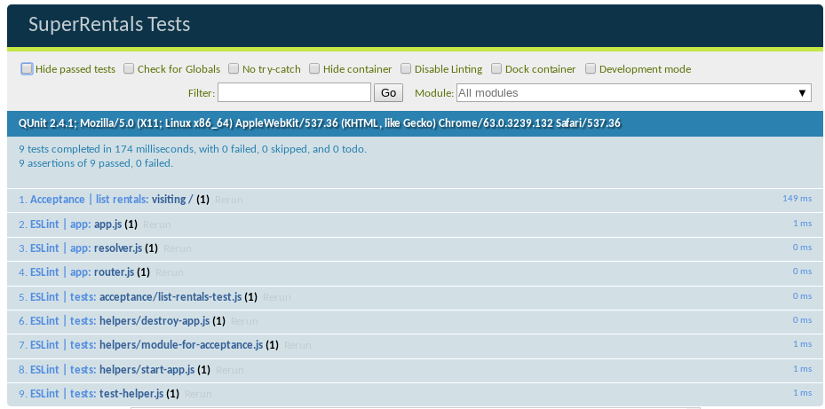

To show the basic setup of an Ember application, we'll walk through building an app for a property rental site called Super Rentals. We'll start with a homepage, an about page and a contact page.

その前に、私たちが作成したいアプリケーションの外観を以下に示します。


それでは、Super Rentalsアプリケーションのhomeページで何をしたいかを考えてみましょう。

* homeページ上に複数の賃貸物件を表示する
* 会社情報にリンクする
* 問い合わせ情報にリンクする
* 利用可能な賃貸物件を一覧表示する
* 都市ごとに賃貸物件の一覧を絞り込む
* 選択された賃貸物件の詳細を表示する

For the remainder of this page, we'll give you an introduction to testing in Ember and get you set up to add tests as we implement pieces of our app. On subsequent tutorial pages, the final sections of each page will be devoted to adding a test for the feature you just implemented. これらのセクションはアプリケーションを動かすのに必須ではないので、それらを書かなくてもチュートリアルを進めることもできます。

現時点でもう[次のページ](../routes-and-templates/)に進むこともできますし、このままEmberのテストに関する詳細を読み進めることもできます。

### 進むたびにアプリケーションをテストする

これらのゴールを、[EmberのAcceptance tests (受け入れテスト)](../../testing/acceptance/)として表現できます。 受け入れテストは、実際に人が行うように相互作用するだけでなく、それを自動で行えます。そうすることで、アプリケーションが将来にわたって壊れないことを担保できます。

Ember CLI を使って新しいプロジェクトを作成した場合、プロジェクトはJavaScriptテストフレームワークの[`QUnit`](https://qunitjs.com/)を使いテストを定義、実行します。

それでは、Ember CLIを使って、Acceptance tests (受け入れテスト) を作成していきましょう。

```shell
ember g acceptance-test list-rentals
```

コマンドを実行すると、次の内容が出力されます。そして、`tests/acceptance/list-rentals-test.js`というファイルが1つ作成されます。.

```shell
installing acceptance-test
  create tests/acceptance/list-rentals-test.js
```

テストファイルの中身は、`list-rentals` ルートに移動して、そのルートが読み読まれることを確認する定型コードとなっています。 この定型コードは、最初の受け入れテストを書く足がかりになります。

Since we haven't added any functionality to our application yet, we'll use this first test to get started on running tests in our app.

そのためには、生成されたテスト中で`/list-rentals`と出てくる箇所を`/`に置き換えてください。 The test will start our app at the base url, `http://localhost:4200/`, and then do a basic check that the page has finished loading and that the url is what we want it to be.

<pre><code class="/tests/acceptance/list-rentals-test.js{-6,+7,-8,+9,-12,+13}">import { test } from 'qunit';
import moduleForAcceptance from 'super-rentals/tests/helpers/module-for-acceptance';

moduleForAcceptance('Acceptance | list-rentals');

test('visiting /list-rentals', function(assert) {
test('visiting /', function(assert) {
  visit('/list-rentals');
  visit('/');

  andThen(function() {
    assert.equal(currentURL(), '/list-rentals');
    assert.equal(currentURL(), '/');
  });
});
</code></pre>

以下は、この簡単なテストについての注意事項です。

* Acceptance tests are setup by calling the function `moduleForAcceptance`. This function ensures that your Ember application is started and shut down between each test.
* QUnitは[`assert`](https://api.qunitjs.com/category/assert/)と呼ばれるオブジェクトをそれぞれのテスト関数に渡します。 `assert`は、`equal()`といった、テスト環境内の条件をテストできる関数を持ちます。 テストは成功するアサートを必ず1つは持つ必要があります。
* Ember acceptance tests use a set of test helper functions, such as the `visit`, `andThen`, and `currentURL` functions used above. チュートリアルの後半で、これらの関数の詳細を説明します。

では、CLIコマンド`ember test --server`を使ってテストスイートを実行しましょう。.

By default, when you run `ember test --server`, Ember CLI runs the [Testem test runner](https://github.com/testem/testem), which runs Qunit in Chrome and [PhantomJS](http://phantomjs.org/).

今は起動されたChromeに10個のテストに成功したと表示しているでしょう。 If you toggle the box labeled "Hide passed tests", you should see our successful acceptance test, along with 9 passing ESLint tests. Ember tests each file you create for syntax issues (known as "linting") using [ESLint](http://eslint.org/).



### 受け入れテストとしてアプリケーションのゴールを追加する

As mentioned before, our initial test just made sure everything was running properly. Now let's replace that test with the list of tasks we want our app to handle (described up above).

<pre><code class="/tests/acceptance/list-rentals-test.js">import { test } from 'qunit';
import moduleForAcceptance from 'super-rentals/tests/helpers/module-for-acceptance';

moduleForAcceptance('Acceptance | list-rentals');

test('should show rentals as the home page', function (assert) {
});

test('should link to information about the company.', function (assert) {
});

test('should link to contact information.', function (assert) {
});

test('should list available rentals.', function (assert) {
});

test('should filter the list of rentals by city.', function (assert) {
});

test('should show details for a selected rental', function (assert) {
});
</code></pre>

`ember test --server`と実行すると、7つのテストに失敗したと表示されるでしょう。 Each of the 6 tests we setup above will fail, plus one ESLint test will fail saying, `assert is defined but never used`. The tests above fail because QUnit requires at least one check for a specific condition (known as an `assert`).

As we continue through this tutorial, we'll use these acceptance tests as our checklist. Once all the tests are passing, we'll have accomplished our high level goals.