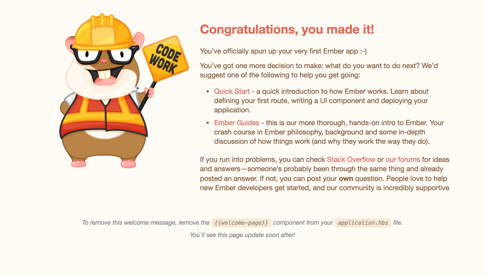

Emberチュートリアルへようこそ！ このチュートリアルでは、基本的なEmberの概念を紹介するために、本格的な見た目のアプリケーションを作成していきます。 If you get stuck at any point during the tutorial, feel free to download <https://github.com/ember-learn/super-rentals> for a working example of the completed app.

[クイックスタート](../../getting-started/quick-start/#toc_install-ember)の「Emberのインストール」セクションにしたがって、`ember-cli` の最新バージョンをインストールできます。

Ember CLIは、Emberのコマンドライン・インターフェイスです。標準的なプロジェクト構造、一連の開発ツール、そしてアドオンのシステムを提供しています。 これによって、Ember開発者はアプリケーションそのものの開発に集中することができます。アプリケーションを実行するサポート環境の構築に手間をかける必要はありません。 コマンドラインで `ember --help` と実行すると、Ember CLIが提供しているコマンド一覧が表示されます。 コマンド毎にさらに詳しい情報を確認したければ、`ember help <command-name>` と実行してください。.

## 新規アプリケーションの作成

Ember CLIを使って新規にプロジェクトを作成するには、`new`コマンドを使います。次のセクションで行うチュートリアルの準備として、`super-rentals`という名前のアプリケーションを作成しておきましょう。.

```shell
ember new super-rentals
```

新しいプロジェクトは、あなたの現在のディレクトリ内に作成されます。これで、`super-rentals` プロジェクトディレクトリに移動して、作業を開始できます。

```shell
cd super-rentals
```

## ディレクトリ構造

`new`コマンドは、次に示すファイルやディレクトリから構成される、プロジェクトを作成します。

```text
|--app
|--config
|--node_modules
|--public
|--tests
|--vendor

<other files>

bower.json
ember-cli-build.js
package.json
README.md
testem.js
```

Ember CLIが作成したファイルやディレクトリを見てみましょう。

**app**: この配下に、モジュールやコンポーネント、ルート、テンプレート、スタイルシート用のディレクトリやファイルが含まれています。Emberプロジェクトにおけるコーディングの大半は、この中で行われます。

**bower.json**: Bowerは依存関係を管理するツールです。 Ember CLIでは、フロントエンドのプラグインやコンポーネントの依存性(HTML、 CSS、 JavaScript など) を管理するために利用が可能です。 すべてのBowerコンポーネントは`bower_components`ディレクトリにインストールされます。 If we add front-end dependencies, such as Bootstrap, we will see them listed here, and added to the `bower_components` directory.

**config**: 設定ファイル用のディレクトリです。ここには、アプリケーションの設定を行う`environment.js` が含まれています。

**node_modules / package.json**: このディレクトリとファイルはnpmに関連しています。 npmはNode.jsのパッケージマネージャーです。 EmberはNodeで構築されていて、動作に様々なNode.jsモジュールを利用しています。 `package.json`ファイルは、アプリケーションのnpmの依存関係のリストを管理しています。追加でインストールしたEmber CLIアドオンがあれば、それもこのリストで管理されます。 `package.json`内にリストされているパッケージは、node_modulesディレクトリにインストールされます。

**public**: このディレクトリには、画像ファイルやフォントなどのアセットが含まれています。

**vendor**: このディレクトリには、Bowerによって管理されないフロントエンドの依存関係 (JavaScript、CSS など) を配置します。

**tests / testem.js**: アプリケーションの自動テストは`tests`ディレクトリ配下に配置します。Ember CLIのテストランナー**testem**は、`testem.js`によって設定されます。.

**ember-cli-build.js**: このファイルには、Ember CLIがアプリケーションをどのようにビルドすべきかを記載します。

## ES6 モジュール

`app/router.js`に目を通すと、見慣れない構文が使われてることに気がつくはずです。

```app/router.js import Ember from 'ember'; import config from './config/environment';

const Router = Ember.Router.extend({ location: config.locationType, rootURL: config.rootURL });

Router.map(function() { });

export default Router;

    <br />Ember CLIは、ECMAScript 2015 (省略してES2015、またはES6とも呼ばれます) モジュールを使って、アプリケーションコードを構造化します。
    例えば、`import Ember from 'ember';` という行は、Ember.jsライブラリを`Ember`という変数で利用できるようにしています。 また、`import config from
    './config/environment';`という行は、アプリケーションの設定データを`config`という変数で利用できるようにしています。 `const` is a way to declare a read-only variable to make
    sure it is not accidentally reassigned elsewhere. ファイルの終わりには`export default Router;
    `という行があります。この行は、このファイル内で定義された変数`Router`を、アプリケーションの他の部分でも利用できるようにしています。
    
    
    ## 開発サーバー
    
    新規のプロジェクトを作成したら、うまく動いていることを確認するために、以下のようにEmberの開発サーバーを起動します。
    
    ```shell
    ember server
    

コマンドは次のように省略することもできます。

```shell
ember s
```

ブラウザで[`http://localhost:4200`](http://localhost:4200)を開くと、デフォルトのウェルカムページが表示されているはずです。 When we edit the `app/templates/application.hbs` file, we'll replace that content with our own.



The first thing we want to do in our new project is to remove the welcome screen. We do this by simply opening up the application template file located at `app/templates/application.hbs`.

Once open, remove the component labeled `{{welcome-page}}`. The application should now be a completely blank canvas to build our application on.

```app/templates/application.hbs{-1,-2,-3} {{!-- The following component displays Ember's default welcome message. --}} {{welcome-page}} {{!-- Feel free to remove this! --}}

{{outlet}}

```