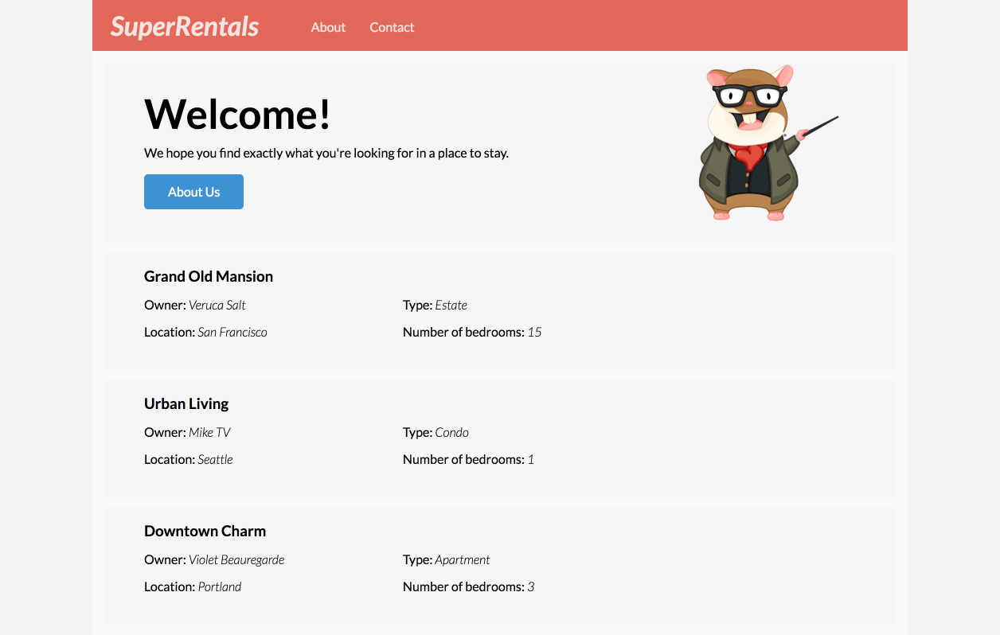

Ember tiene un rico ecosistema de addons (complementos) que pueden añadirse fácilmente a los proyectos. Los addons (complementos) proveen una amplia gama de funcionalidad a los proyectos, a menudo ahorrando de tiempo y dejando que te enfoques en tu proyecto.

Para buscar addons (complementos), visite el sitio web de [Ember Observer](https://emberobserver.com/). Cataloga y clasifica los addons (complementos) que se han publicado en NPM y les asigna una puntuación basado en una variedad de criterios.

Para Super Rentals, utilizaremos dos addons: [ember-cli-tutorial-style](https://github.com/toddjordan/ember-cli-tutorial-style) y [ember-cli-mirage](http://www.ember-cli-mirage.com/).

### ember-cli-tutorial-style

En lugar de tener que copiar/pegar el CSS de Super Rentals, hemos creado un addon (complemento) llamado [ember-cli-tutorial-style](https://github.com/ember-learn/ember-cli-tutorial-style) que inmediatamente añadirá el CSS para el tutorial. The addon works by generating a file called `ember-tutorial.css` and putting that file in the super-rentals `vendor` directory.

The [`vendor` directory](../../addons-and-dependencies/managing-dependencies/#toc_other-assets) in Ember is a special directory where you can include content that gets compiled into your application. When Ember CLI builds our app from our source code, it copies `ember-tutorial.css` into a file called `vendor.css`.

As Ember CLI runs, it takes the `ember-tutorial` CSS file and puts it in a file called `vendor.css`. The `vendor.css` file is referenced in `app/index.html`, making the styles available at runtime.

We can make additional style tweaks to `vendor/ember-tutorial.css`, and the changes will take effect whenever we restart the app.

Run the following command to install the addon:

```shell
ember install ember-cli-tutorial-style
```

Since Ember addons are npm packages, `ember install` installs them in the `node_modules` directory, and makes an entry in `package.json`. Be sure to restart your server after the addon has installed successfully. Restarting the server will incorporate the new CSS and refreshing the browser window will give you this:



### ember-cli-mirage

[Mirage](http://www.ember-cli-mirage.com/) is a client HTTP stubbing library often used for Ember acceptance testing. For the case of this tutorial, we'll use mirage as our source of data. Mirage will allow us to create fake data to work with while developing our app and mimic a running backend server.

Install the Mirage addon as follows:

```shell
ember install ember-cli-mirage
```

Let's now configure Mirage to send back our rentals that we had defined above by updating `mirage/config.js`:

```mirage/config.js
export default function() {
  this.namespace = '/api';

  this.get('/rentals', function() {
    return {
      data: [{
        type: 'rentals',
        id: 'grand-old-mansion',
        attributes: {
          title: 'Grand Old Mansion',
          owner: 'Veruca Salt',
          city: 'San Francisco',
          type: 'Estate',
          bedrooms: 15,
          image: 'https://upload.wikimedia.org/wikipedia/commons/c/cb/Crane_estate_(5).jpg'
        }
      }, {
        type: 'rentals',
        id: 'urban-living',
        attributes: {
          title: 'Urban Living',
          owner: 'Mike Teavee',
          city: 'Seattle',
          type: 'Condo',
          bedrooms: 1,
          image: 'https://upload.wikimedia.org/wikipedia/commons/0/0e/Alfonso_13_Highrise_Tegucigalpa.jpg'
        }
      }, {
        type: 'rentals',
        id: 'downtown-charm',
        attributes: {
          title: 'Downtown Charm',
          owner: 'Violet Beauregarde',
          city: 'Portland',
          type: 'Apartment',
          bedrooms: 3,
          image: 'https://upload.wikimedia.org/wikipedia/commons/f/f7/Wheeldon_Apartment_Building_-_Portland_Oregon.jpg'
        }
      }]
    };
  });
}
```

This configures Mirage so that whenever Ember Data makes a GET request to `/api/rentals`, Mirage will return this JavaScript object as JSON. In order for this to work, we need our application to default to making requests to the namespace of `/api`. Without this change, navigation to `/rentals` in our application would conflict with Mirage.

To do this, we want to generate an application adapter.

```shell
ember generate adapter application
```

This adapter will extend the [`JSONAPIAdapter`](http://emberjs.com/api/data/classes/DS.JSONAPIAdapter.html) base class from Ember Data:

```app/adapters/application.js
import DS from 'ember-data';

export default DS.JSONAPIAdapter.extend({
  namespace: 'api'
});

```

If you were running `ember serve` in another shell, restart the server to include Mirage in your build.
