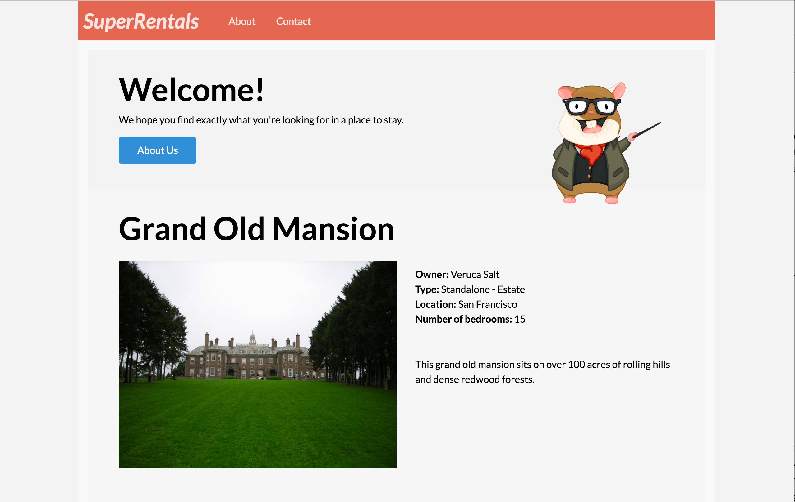
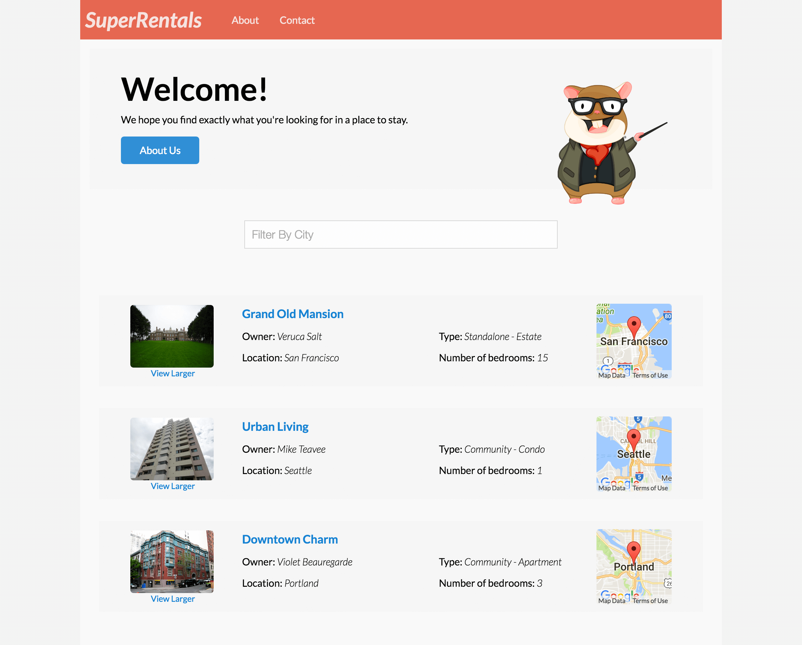
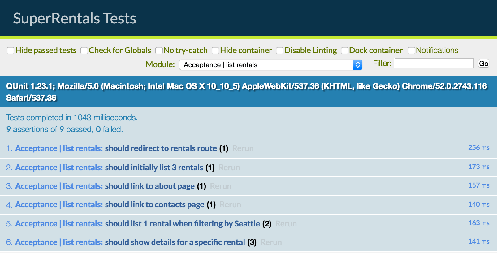

ここまでで、4つのトップレベル route (ルート)を作成しました。

* アプリケーションに関する情報を与える`about` route (ルート)。
* 会社への連絡方法に関する情報である`連絡先` route(ルート)。
* 賃貸物件を閲覧できる`rentals</ 0> route(ルート)。</li>
<li><code>rentals</ 0> route(ルート)にリダイレクトするように設定した<code>index` route(ルート)。

`rentals` toute(ルート)は複数の機能を提供します。 [acceptance test (受入テスト)](../acceptance-test)では、ユーザーが賃貸物件を閲覧して検索できるようにし、それぞれの賃貸物件の詳細情報も表示できるようにしました。 この要件を満たすために、Emberの[ネスト化されたルート機能](../../routing/defining-your-routes/#toc_nested-routes)を利用する予定です。

このセクションの最後には、次の新しい route(ルート)を作成したいと考えています。

* 賃貸物件ページの一般情報と閲覧可能な賃貸物件のリストも表示する`rentals/index` route(ルート)。 ユーザーが`rentals`というURLを訪れると、ネストされたindex route(ルート)がデフォルトで表示されます。
* 賃貸物件ページの一般情報を表示し、選択した賃貸物件に関する詳細情報も表示する`rentals/show` route(ルート)。 `show` route(ルート)は表示されている賃貸物件のIDで置き換えられます(`rentals/grand-old-mansion`のように)。

## 親 route(ルート)

前の[ルートとテンプレートのチュートリアル](../routes-and-templates)で、`rentals` route(ルート)を設定していました。

このroute(ルート)のテンプレートを開くと、route(ルート)の一般ページ情報の下にあるoutletが表示されます。 テンプレートの一番下に`{{outlet}}`ヘルパーがあることがわかります。 これはアクティブなネストされたroute(ルート)が描画される場所です。

```app/templates/rentals.hbs
<div class="jumbo">
  <div class="right tomster"></div>
  <h2>Welcome!</h2>
  <p>We hope you find exactly what you're looking for in a place to stay.</p>
  {{#link-to 'about' class="button"}}
    About Us
  {{/link-to}}
</div>
{{#list-filter
   filter=(action 'filterByCity')
   as |rentals|}}
  <ul class="results">
    {{#each rentals as |rentalUnit|}}
      <li>{{rental-listing rental=rentalUnit}}</li>
    {{/each}}
  </ul>
{{/list-filter}}
{{outlet}}
```

親route(ルート)を持つということは、子route(ルート)を閲覧する際に親route(ルート)テンプレート上のコンテンツがすべて存在することを意味します。これによって、共通の指示、ナビゲーション、フッターまたはサイドバーのようなものを追加することができます。

## ネストされたindex route(ルート)の生成

最初に作るネストされたroute(ルート)はindex route(ルート)になります。 ネストされたindex route(ルート)は、ベースのindex route(ルート)と同様に機能します。 これは、route(ルート)が提供されていないときに描画されるデフォルトroute(ルート)です。 したがって、`/rentals`に移動すると、Emberはrentals index route(ルート)をネストされたroute(ルート)としてロードしようとします。

ネストされたindex route(ルート)を作成するには、次のコマンドを実行します。

```shell
ember g route rentals/index
```

Router (`app/router.js`)を開くと、rentalsの行が更新されていることに気づくでしょう。 この追加の`function() {}`は、子ルートを必要とするために必要なものです。`this.route('index', { path: '/'});`は暗黙的に存在します。

```app/router.js
Router.map(function() {
  this.route('about');
  this.route('contact');
  this.route('rentals', function() {});
});
```

アプリケーションの`index` route(ルート)がRouter(ルータ)に表示されないように、サブルートの`index` route(ルート)もRouter(ルータ)には明示的に表示されません。 Emberはデフォルトのアクションが`index`ルートにユーザを移動させることであることを認識しています。 ただし、カスタマイズする場合には`index` route(ルート)を追加できます。 たとえば、`index` route(ルート)のパスを`this.route('index', { path: '/custom-path'})`で特定するには、次のようにします。

[Ember Dataを使用する](../ember-data#toc_updating-the-model-hook)セクションでは、すべての賃貸物件をフェッチする呼び出しを追加しました。 この`findAll`呼び出しを親の`rentals` route(ルート)から新しいサブroute(ルート)に移動することによって、新しく生成された`rentals/index` route(ルート)を実装しましょう。

```app/routes/rentals.js{-2,-3,-4}
export default Ember.Route.extend({
  model() {
    return this.get('store').findAll('rental');
  }
});
```

```app/routes/rentals/index.js{+2,+3,+4}
export default Ember.Route.extend({
  model() {
    return this.get('store').findAll('rental');
  }
});
```

すべての賃貸物件をネストされたroute (ルート)のモデルに戻したので、次は賃貸物件リストのマークアップをメインのroute (ルート)テンプレートからネストされたindex route(ルート)のテンプレートに移動します。

```app/templates/rentals.hbs{-9,-10,-11,-12,-13,-14,-15,-16,-17}
<div class="jumbo">
  <div class="right tomster"></div>
  <h2>Welcome!</h2>
  <p>We hope you find exactly what you're looking for in a place to stay.</p>
  {{#link-to 'about' class="button"}}
    About Us
  {{/link-to}}
</div>
{{#list-filter
   filter=(action 'filterByCity')
   as |rentals|}}
  <ul class="results">
    {{#each rentals as |rentalUnit|}}
      <li>{{rental-listing rental=rentalUnit}}</li>
    {{/each}}
  </ul>
{{/list-filter}}
{{outlet}}
```

```app/templates/rentals/index.hbs{+1,+2,+3,+4,+5,+6,+7,+8,+9}
{{#list-filter
   filter=(action 'filterByCity')
   as |rentals|}}
  <ul class="results">
    {{#each rentals as |rentalUnit|}}
      <li>{{rental-listing rental=rentalUnit}}</li>
    {{/each}}
  </ul>
{{/list-filter}}
{{outlet}}
```

最後に、新しいネストしたindex route(ルート)でfilterアクションを使用できるコントローラを作成する必要があります。

まず、`ember g controller rentals/index`を実行して、ネストされたroute(ルート)のindexコントローラを作成します。

`app/controller/rentals.js`からコントローラファイル全体を`app/controller/ rentals/index.js`にコピーするのではなく、JavaScriptの import/export 機能を利用して、rentalsコントローラをrentals/indexコントローラとして再エクスポートするだけです。

```app/controllers/rentals/index.js
import RentalsController from '../rentals';

export default RentalsController;
```

## ネストした詳細route(ルート)にデータを設定する

次に、特定の賃貸物件の詳細情報を表示するサブroute(ルート)を作成します。 それをするために、いくつかのファイルを更新する必要があります。 特定の賃貸物件を見つけるために、Ember Dataの`findRecord`関数を使います[(詳細は「レコードを取得する」を参照してください)](../../models/finding-records/)。 `findRecord`関数を使うには、ユニークキーを使って検索する必要があります。

`show` route(ルート)上で、特定の賃貸物件に関する追加情報も表示しましょう。

これを行うには、[「Addonをインストールする」セクション](../installing-addons)で追加したMirageの`config.js`ファイルを変更する必要があります。 特定の賃貸物件を返す新しいroute(ルート)ハンドラを追加しましょう。

```mirage/config.js{+57,+58,+59,+60}
export default function() {
  this.namespace = '/api';

  let rentals = [
    {
      type: 'rentals',
      id: 'grand-old-mansion',
      attributes: {
        title: "Grand Old Mansion",
        owner: "Veruca Salt",
        city: "San Francisco",
        propertyType: "Estate",
        bedrooms: 15,
        image: "https://upload.wikimedia.org/wikipedia/commons/c/cb/Crane_estate_(5).jpg",
        description: "This grand old mansion sits on over 100 acres of rolling hills and dense redwood forests."
      }
    },
    {
      type: 'rentals',
      id: 'urban-living',
      attributes: {
        title: "Urban Living",
        owner: "Mike Teavee",
        city: "Seattle",
        propertyType: "Condo",
        bedrooms: 1,
        image: "https://upload.wikimedia.org/wikipedia/commons/0/0e/Alfonso_13_Highrise_Tegucigalpa.jpg",
        description: "A commuters dream. This rental is within walking distance of 2 bus stops and the Metro."
      }
    },
    {
      type: 'rentals',
      id: 'downtown-charm',
      attributes: {
        title: "Downtown Charm",
        owner: "Violet Beauregarde",
        city: "Portland",
        propertyType: "Apartment",
        bedrooms: 3,
        image: "https://upload.wikimedia.org/wikipedia/commons/f/f7/Wheeldon_Apartment_Building_-_Portland_Oregon.jpg",
        description: "Convenience is at your doorstep with this charming downtown rental. Great restaurants and active night life are within a few feet."
      }
    }
  ];

  this.get('/rentals', function(db, request) {
    if (request.queryParams.city !== undefined) {
      let filteredRentals = rentals.filter(function (i) {
        return i.attributes.city.toLowerCase().indexOf(request.queryParams.city.toLowerCase()) !== -1;
      });
      return { data: filteredRentals };
    } else {
      return { data: rentals };
    }
  });

  // Find and return the provided rental from our rental list above
  this.get('/rentals/:id', function (db, request) {
    return { data: rentals.find((rental) => request.params.id === rental.id) };
  });

}
```

## ネストした詳細route(ルート)を生成する

個別の賃貸物件を返すAPIが準備ができたので、これで`show`サブroute(ルート)を生成できます。 `rentals` route(ルート)を生成するのと同じように、`ember g `を使用してネストされたroute(ルート)を作成します。

```shell
ember g route rentals/show
```

出力は以下のようになります。

```shell
installing route
  create app/routes/rentals/show.js
  create app/templates/rentals/show.hbs
updating router
  add route rentals/show
installing route-test
  create tests/unit/routes/rentals/show-test.js
```

Router (`app/router.js`)への変更から見ていきましょう。

```app/router.js{+5}
Router.map(function() {
  this.route('about');
  this.route('contact');
  this.route('rentals', function() {
    this.route('show');
  });
});
```

新しいroute(ルート)は`rentals` route(ルート)の中にネストされています。 これはEmberに、それがサブroute(ルート)であり、`localhost:4200/rentals/show`を介してアクセスされることを伝えます。

どの賃貸物件にアクセスするかをアプリケーションに伝えるには、`show` route(ルート)パスを賃貸物件リストのIDに置き換える必要があります。 `localhost:4200/rentals/id-for-rental`と見えるように、URLも単純化したいと考えています。

これをするために、route(ルート)を以下のように編集します。

```app/router.js{+5}
Router.map(function() {
  this.route('about');
  this.route('contact');
  this.route('rentals', function() {
    this.route('show', { path: '/:rental_id' });
  });
});
```

これで`rental_id`はroute(ルート)に渡されるようになります。

## IDによる検索

次に、リクエストされた賃貸物件を取得するように、`show` route(ルート) を編集します。

```app/routes/rentals/show.js{+2,+3,+4}
export default Ember.Route.extend({
  model(params) {
    return this.get('store').findRecord('rental', params.rental_id);
  }
});
```

Routerのパス`show`に`:rental_id`を追加したので、`model`フックで`rental_id`を利用できるようになっています。 `this.get('store').findRecord('rental', params.rental_id)`を呼び出すと、Ember Dataは、HTTP GETを使用して`/rentals/our-id`を照会します([詳細はこちら](../../models/))。

## テンプレートに賃貸物件を追加する

これで、show route(ルート) (`app/templates/rentals/show.hbs`) のテンプレートを更新し、賃貸物件の情報を一覧表示することができます。

```app/templates/rentals/show.hbs
<div class="jumbo show-listing">
  <h2 class="title">{{model.title}}</h2>
  <div class="right detail-section">
    <div class="detail owner">
      <strong>Owner:</strong> {{model.owner}}
    </div>
    <div class="detail">
      <strong>Type:</strong> {{rental-property-type model.propertyType}} - {{model.propertyType}}
    </div>
    <div class="detail">
      <strong>Location:</strong> {{model.city}}
    </div>
    <div class="detail">
      <strong>Number of bedrooms:</strong> {{model.bedrooms}}
    </div>
    <p class="description">{{model.description}}</p>
  </div>
  
</div>
```

`localhost:4200/rentals/grand-old-mansion`を参照すると、特定の賃貸物件情報が表示されます。



## 特定の賃貸物件へリンクする

個々の賃貸物件用のページをロードできるようになったので、`rental-listing` component (コンポーネント)内にリンク(`link-to`ヘルパーを使って)を追加して個々のページに移動するようにします。 ここでは、`link-to`ヘルパーはroute (ルート)名と物件のモデルオブジェクトを引数として受け取ります。 `link-to`のブロックヘルパーに第二引数としてオブジェクトを渡すと、デフォルトではオブジェクトをモデルのIDからURLに[serializeする](http://emberjs.com/api/classes/Ember.Route.html#method_serialize)ことになります。 または、明確に`rental.id`を渡すこともできます。

タイトルをクリックすると、その物件の詳細ページが読み込まれます。

```app/templates/components/rental-listing.hbs{+6}
<article class="listing">
  <a {{action 'toggleImageSize'}} class="image {{if isWide "wide"}}">
    
    <small>View Larger</small>
  </a>
  <h3>{{#link-to "rentals.show" rental}}{{rental.title}}{{/link-to}}</h3>
  <div class="detail owner">
    <span>Owner:</span> {{rental.owner}}
  </div>
  <div class="detail type">
    <span>Type:</span> {{rental-property-type rental.propertyType}}
      - {{rental.propertyType}}
  </div>
  <div class="detail location">
    <span>Location:</span> {{rental.city}}
  </div>
  <div class="detail bedrooms">
    <span>Number of bedrooms:</span> {{rental.bedrooms}}
  </div>
  {{location-map location=rental.city}}
</article>
```



この時点で[デプロイ](../deploying/)し、SuperRentalsアプリケーションを世界に公開できます。 あるいは、このアプリケーションをベースにして、他のEmberの機能やアドオンを探索できます。 それに関わらず、このアプリケーションが、あなたがEmberを使って野心的なアプリケーションを作成する助けになっていることを願っています!

### 受入テスト

最後に、特定の賃貸物件をクリックし、詳細ページを読み込むことを検証しましょう。 タイトルをクリックし、拡大した賃貸物件の説明が表示されることを確認します。

```/tests/acceptance/list-rentals-test.js
test('should show details for a specific rental', function (assert) {
  visit('/rentals');
  click('a:contains("Grand Old Mansion")');
  andThen(function() {
    assert.equal(currentURL(), '/rentals/grand-old-mansion', 'should navigate to show route');
    assert.equal(find('.show-listing h2').text(), "Grand Old Mansion", 'should list rental title');
    assert.equal(find('.description').length, 1, 'should list a description of the property');
  });
});
```

この時点で、最初に要件として作成した[acceptance test (受入テスト)のリスト](../acceptance-test)を含む、すべてのテストは合格するはずです。

